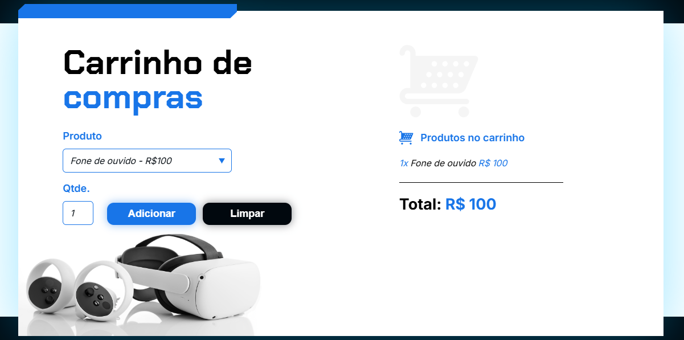

# 🛒 Carrinho de Compras

Um carrinho de compras interativo que permite aos usuários adicionar produtos, calcular o total e limpar o carrinho. Este projeto foi desenvolvido como parte do curso de Lógica de Programação da Alura, focando na prática de conceitos de programação.

## 🚀 Tecnologias Utilizadas
- HTML
- CSS
- JavaScript

## 🌟 Funcionalidades
- Adicionar produtos ao carrinho
- Calcular o total dos produtos
- Limpar o carrinho

## 📂 Estrutura do Projeto

O projeto está organizado nos seguintes arquivos e pastas:

- **`index.html`**: Página principal do carrinho de compras.  
- **`style.css`**: Estilos da aplicação.  
- **`js/`**: Pasta para arquivos JavaScript.  
  - **`app.js`**: Lógica do carrinho de compras.  
- **`assets/`**: Pasta para imagens e outros recursos.
